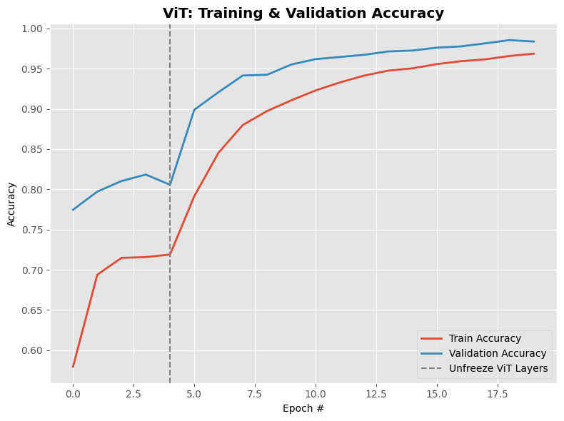
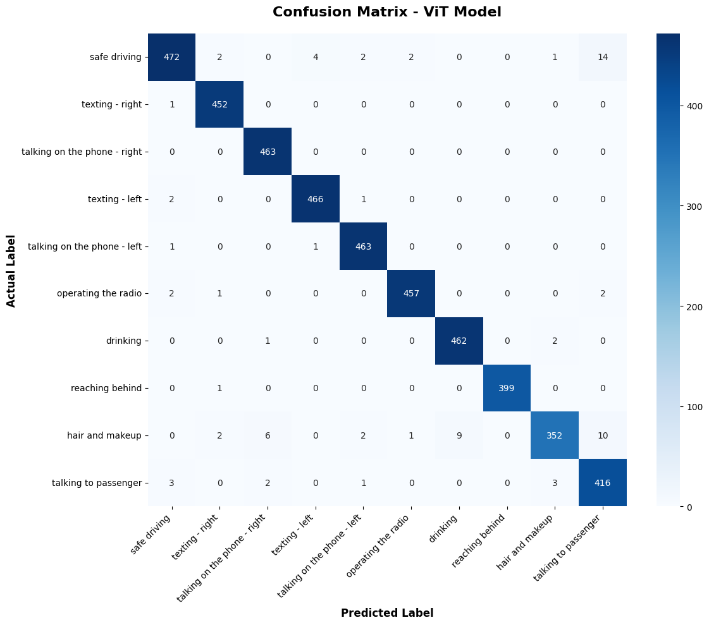

(Project done in March)

Driver Distraction Monitoring System Using ViT

An end-to-end computer vision project for classifying driver behavior from video using a Vision Transformer (ViT-B16). The repository covers model training and evaluation, video preprocessing, temporally stabilized inference, a Tkinter desktop interface, and annotated video export.

## Overview

Driver distraction is a major road-safety concern. This project analyzes video frames and assigns each frame to one of ten driver-behavior classes. A short prediction history is used to reduce rapid label changes and produce a more stable result across consecutive frames.

The project includes:

- Transfer learning with a pretrained ViT-B16 backbone
- Partial fine-tuning of the final backbone layers
- Ten-class driver-behavior classification
- Video frame extraction and preprocessing with OpenCV
- Region-of-interest cropping to focus on the driver
- Temporal smoothing over recent predictions
- Confidence-aware result visualization
- A Tkinter interface for selecting and processing videos
- Export of an annotated output video

## Demo Workflow

```text
Input video
    |
    v
Read frame with OpenCV
    |
    v
Crop driver region -> RGB conversion -> Resize to 224 x 224
    |
    v
ViT preprocessing -> ViT-B16 classification
    |
    v
Majority vote over the latest 15 predictions
    |
    v
Display class and confidence -> Save annotated AVI video
```

## Behavior Classes

The model predicts one of the following classes:

| ID | Class |
|---:|---|
| 0 | Safe driving |
| 1 | Texting - right |
| 2 | Talking on the phone - right |
| 3 | Texting - left |
| 4 | Talking on the phone - left |
| 5 | Operating the radio |
| 6 | Drinking |
| 7 | Reaching behind |
| 8 | Hair and makeup |
| 9 | Talking to passenger |

## Model Architecture

The classifier is built with `vit-keras` and TensorFlow/Keras.

```text
Input image: 224 x 224 x 3
        |
        v
Pretrained ViT-B16 backbone
include_top=False
        |
        v
Flatten
        |
        v
Batch Normalization
        |
        v
Dense layer with 10 outputs and softmax activation
```

Most of the ViT backbone is frozen. The final four backbone layers remain trainable for task-specific fine-tuning.

## Results

The experiment achieved a reported test accuracy of **98.2%**. The repository includes the training/validation accuracy curve and confusion matrix used to inspect overall convergence and class-level errors.

### Training and Validation Accuracy



### Confusion Matrix



## Repository Structure

```text
.
├── Driver_Distraction_Monitoring_System.ipynb  # Training and evaluation workflow
├── vit_model.py                                # ViT-B16 model definition
├── inference.py                                # Video inference and Tkinter application
├── accu.png                                    # Accuracy visualization
├── cf.png                                      # Confusion matrix
├── .gitignore
└── README.md
```

## Requirements

- Python with a version supported by your TensorFlow installation
- TensorFlow
- vit-keras
- OpenCV
- NumPy
- Pillow
- Tkinter, normally included with standard Python installations on Windows
- A trained weights file named `vit_distraction_weights.weights.h5`

## Installation

Clone the repository:

```bash
git clone https://github.com/longbui125/Driver-Distraction-Monitoring-System-Using-ViT.git
cd Driver-Distraction-Monitoring-System-Using-ViT
```

Create and activate a virtual environment.

### Windows

```powershell
python -m venv .venv
.venv\Scripts\Activate.ps1
```

### macOS or Linux

```bash
python3 -m venv .venv
source .venv/bin/activate
```

Install the runtime dependencies:

```bash
python -m pip install --upgrade pip
pip install tensorflow vit-keras opencv-python numpy pillow
```

If you want to run the training notebook locally, also install Jupyter and the common evaluation libraries:

```bash
pip install jupyter matplotlib seaborn scikit-learn
```

## Model Weights

`inference.py` loads the following file from the repository root:

```text
vit_distraction_weights.weights.h5
```

The weights file is not currently included in the repository. Before running the desktop application, use one of these options:

1. Run `Driver_Distraction_Monitoring_System.ipynb`, update its dataset paths, complete training, and save the final weights with the filename above.
2. Place an existing compatible weights file in the repository root and rename it to `vit_distraction_weights.weights.h5`.

The weights must match the architecture in `vit_model.py`: ViT-B16 input size `224 x 224 x 3` with ten output classes.

## Training

Open the notebook:

```bash
jupyter notebook Driver_Distraction_Monitoring_System.ipynb
```

Before running all cells:

1. Configure the dataset paths used by the notebook.
2. Ensure the dataset labels map to the ten classes listed above.
3. Confirm images are separated correctly into training, validation, and test sets.
4. Run preprocessing and augmentation cells.
5. Train and fine-tune the ViT-B16 model.
6. Evaluate the final model on the held-out test set.
7. Save the trained weights:

```python
model.save_weights("vit_distraction_weights.weights.h5")
```

Keep the class ordering used during training identical to the `classes` list in `inference.py`. A different order will produce incorrect labels even if the model accuracy is high.

## Running the Application

After placing the trained weights in the repository root, start the application:

```bash
python inference.py
```

Then:

1. Select **Choose File**.
2. Choose an `.mp4` or `.avi` video.
3. Select **Start** to begin inference.
4. Review the predicted behavior and confidence displayed on the video.
5. Select **Stop** to stop processing and finalize the output file.

The annotated video is saved next to the input video using this naming pattern:

```text
<original_filename>_output.avi
```

For example:

```text
driver_test.mp4 -> driver_test_output.avi
```

## Inference Details

### Frame Preprocessing

For each input frame, the application:

1. Keeps the leftmost 90% of the frame to reduce background content around the passenger seat.
2. Converts the cropped frame from BGR to RGB.
3. Resizes it to `224 x 224` pixels.
4. Applies `vit.preprocess_inputs`.
5. Adds a batch dimension before model inference.

### Temporal Smoothing

The application stores the most recent 15 predicted class IDs:

```python
HISTORY_LENGTH = 15
```

The displayed class is selected by majority vote over this history. This reduces flickering when predictions vary between adjacent frames.

### Confidence Display

The configured confidence threshold is:

```python
CONFIDENCE_THRESHOLD = 0.7
```

- Confidence at or above 0.7 is displayed in green.
- Confidence below 0.7 is displayed in yellow.

The threshold changes the display color; it does not suppress the predicted class.

### Video Export

Processed frames are resized to `800 x 450` and exported with the XVID codec. The source video's FPS is reused when available; otherwise, the application falls back to 30 FPS.

## Troubleshooting

### Weights file not found

```text
FileNotFoundError: vit_distraction_weights.weights.h5
```

Place the trained weights in the repository root and confirm the filename matches exactly.

### Unable to open the interface

Confirm Tkinter is available:

```bash
python -m tkinter
```

On Debian or Ubuntu, install it with:

```bash
sudo apt-get install python3-tk
```

### Video opens but no output is saved

- Check that the input video's directory is writable.
- Confirm OpenCV supports the XVID codec on your system.
- Select **Stop** or allow the video to finish so the writer can release the output file.

### Labels do not match the video

- Confirm the training label order matches the `classes` list in `inference.py`.
- Confirm the loaded weights were trained with the model defined in `vit_model.py`.
- Use videos with a viewpoint similar to the training data.

### Predictions change too frequently

Increase `HISTORY_LENGTH` for stronger smoothing. This can improve visual stability but will make the displayed label respond more slowly.

## Current Limitations

- The application processes uploaded video files and does not currently use a live webcam stream.
- The trained weights are not stored in the repository.
- The region-of-interest crop assumes the driver is primarily on the left side of the frame.
- Majority-vote smoothing can delay detection when the driver's behavior changes quickly.
- The same confidence threshold is used for all classes.
- The application is a research prototype and has not been validated as a safety-critical automotive system.

## Possible Improvements

- Add webcam and real-time camera support.
- Provide a `requirements.txt` file with tested dependency versions.
- Add configurable confidence and smoothing settings to the interface.
- Measure inference latency, throughput, and memory use on CPU and GPU.
- Add per-class precision, recall, and F1-score reporting.
- Evaluate subject-independent dataset splits to reduce driver identity leakage.
- Replace fixed cropping with driver detection or configurable regions of interest.
- Add alerts for sustained distracted behavior.
- Export predictions and timestamps to CSV for later analysis.
- Convert the model to TensorFlow Lite or ONNX for edge deployment.
